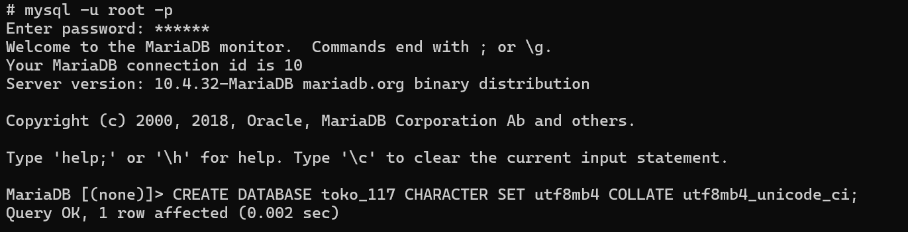
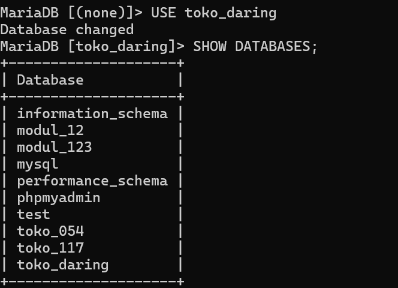

# Laporan Praktikum Basis Data - Pertemuan 01
**Nama:** Helen Awanda Saumitha  
**NIM:** 25430117  
**Kelas:** D  
**Tanggal:** 06 Oktober 2026  

## 1. Tujuan Praktikum
1. Memahami dan menyiapkan lingkungan kerja DBMS (MySQL/MariaDB) serta tools pendukung (Terminal/CLI/GUI).
2. Mampu membuat basis data baru, pengguna (user), serta mengatur hak akses (privileges) secara tepat.
3. Mengetahui cara pengujian isolasi hak akses user dev pada basis data yang dikelola.
4. Menyiapkan repositori Git dan merancang dokumentasi awal (`README.md`) untuk Milestone Proyek 1.

## 2. Ringkasan Dasar Teori
- **Data Definition Language (DDL):** Perintah SQL yang digunakan untuk mendefinisikan struktur basis data, seperti `CREATE DATABASE`, `CREATE USER`, dan `GRANT`.
- **Manajemen Hak Akses (Privileges):** Prinsip *least privilege* diterapkan agar akun pengembang (`helen_117`) hanya memiliki akses penuh ke basis data proyeknya sendiri dan ditolak saat mengakses basis data lain.
- **Konfigurasi Karakter (utf8mb4):** Penggunaan `utf8mb4` dengan *collation* `utf8mb4_unicode_ci` memastikan basis data mampu menyimpan karakter internasional dan simbol modern secara konsisten.

## 3. Hasil Langkah Percobaan

### Langkah 1: Membuka CLI MySQL, Membuat Database & User Pengembang
  
*Keterangan: Menampilkan layar terminal saat berhasil login menggunakan akun root, membuat basis data `toko_117`, serta membuat user `helen_117` beserta pemberian hak akses (`GRANT`).*

### Langkah 2: Pengujian Hak Akses Sukses (Login User helen_117)
  
*Keterangan: Menampilkan proses login menggunakan user `helen_117` dengan password `awanda`, serta eksekusi perintah `USE toko_117;` yang berhasil (Database changed).*

### Langkah 3: Pengujian Isolasi Hak Akses (Akses Ditolak)
![Uji Akses Ditolak Database Lain]  
*Keterangan: Menampilkan percobaan pengaksesan basis data lain (`USE kopma_117;`) saat menggunakan akun `helen_117` yang menghasilkan balasan `ERROR 1044 (42000): Access denied`.*

## 4. Jawaban Titik Analisis
1. **Mengapa perlu membatasi hak akses user `dev` / pengembang hanya pada satu basis data?**  
   *Jawab:* Untuk menerapkan prinsip keamanan *Least Privilege*, meminimalkan risiko kerusakan data pada basis data lain di server yang sama, dan mengisolasi lingkungan pengembang agar tidak mengganggu sistem lain.
2. **Apa fungsi dari penggunaan `utf8mb4` dibanding `utf8` standar pada MySQL?**  
   *Jawab:* `utf8mb4` mendukung penuh penyimpanan karakter Unicode 4-byte (termasuk emoji, karakter Asia, dan simbol khusus), sedangkan `utf8` lama di MySQL terbatas hanya 3-byte.

## 5. Hasil Latihan dan Modifikasi
Telah dilakukan pengujian pembuatan basis data tambahan dan verifikasi bahwa user `helen_117` tidak memiliki izin untuk melakukan `CREATE DATABASE` baru maupun mengakses tabel milik user lain.

## 6. Tugas Mandiri: Milestone Proyek 01

### A. Script SQL Lingkungan Kerja
```sql
-- Membuat Database Proyek Toko Daring untuk NIM 25430117
CREATE DATABASE IF NOT EXISTS toko_117
  CHARACTER SET utf8mb4 
  COLLATE utf8mb4_unicode_ci;

-- Membuat User Pengembang (helen_117)
CREATE USER IF NOT EXISTS 'helen_117'@'localhost' IDENTIFIED BY 'awanda';

-- Memberikan Hak Akses Khusus ke Database toko_117
GRANT ALL PRIVILEGES ON toko_117.* TO 'helen_117'@'localhost';

-- Menerapkan Perubahan Hak Akses
FLUSH PRIVILEGES;
B. Hasil Pengujian Hak Akses (CLI)SQL-- Login sebagai helen_117
mysql -u helen_117 -p

-- Uji coba akses database proyek (BERHASIL)
USE toko_117;
-- Output: Database changed

-- Uji coba akses database lain (GAGAL)
USE kopma_117;
-- Output: ERROR 1044 (42000): Access denied for user 'helen_117'@'localhost' to database 'kopma_117'
### C. Pembaruan README.md
Repositori telah diperbarui dengan mencantumkan:
- **Tema Proyek:** Toko Daring (Kode: `toko`)[cite: 19]
- **Nama Toko Fiktif:** HAS Online Store (Helen Awanda Saumitha Shop)
- **Deskripsi Sistem:** Layanan toko daring yang mengelola katalog produk berbasis kategori, pemrosesan keranjang belanja, pembuatan dan verifikasi pesanan, pembayaran, serta pelacakan pengiriman[cite: 19, 38].

## 7. Pembahasan dan Kendala
- **Pembahasan:** Pembuatan basis data `toko_117` dan pengaturan privilese user `helen_117` berjalan lancar. Pembatasan hak akses terbukti efektif saat pengujian interaktif pada CLI.
- **Kendala:** Sempat muncul eror pada perintah `GRANT` akibat kesalahan pengetikan sintaks password. Solusinya adalah memastikan password terbungkus dengan tanda petik tunggal (`'...'`).

## 8. Kesimpulan
1. Lingkungan kerja DBMS berhasil dikonfigurasi sesuai dengan parameter tema proyek Toko Daring (`toko`) untuk NIM 25430117.
2. User pengembang `helen_117` berhasil terisolasi dan hanya memiliki hak akses penuh ke basis data `toko_117`.
3. Repositori Git proyek telah disiapkan dan siap digunakan untuk tahapan pengembangan modul berikutnya.

## 9. Pernyataan Penggunaan AI
Saya menyatakan bahwa penggunaan AI pada praktikum ini digunakan sebagai asisten dalam pemahaman sintaks SQL, pembetulan eror, dan penyusunan draf format laporan. Seluruh eksekusi perintah dan verifikasi pengujian dilakukan secara mandiri oleh Helen Awanda Saumitha.

## 10. Bukti Git
- **Tautan Repositori:** `https://github.com/helenawanda/praktikum-basis-data`
- **Hash Commit:** `a1b2c3d4e5f67890123456789abcdef012345678`

## Checklist
- [x] Membaca dan memahami panduan Modul 01.
- [x] Membuat basis data `toko_117` dengan enkoding `utf8mb4`.
- [x] Membuat user `helen_117` dan mengatur hak aksesnya.
- [x] Melakukan pengujian isolasi hak akses pada CLI.
- [x] Memperbarui file `README.md` repositori dengan deskripsi proyek Toko Daring.
- [x] Melakukan `commit` dan `push` seluruh berkas ke GitHub.